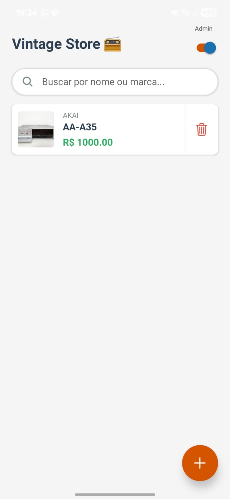

```markdown
# Vintage Audio Store 📻


> Aplicativo móvel para gestão e catalogação de equipamentos de áudio clássicos (Vintage), desenvolvido como projeto da disciplina de Programação para Dispositivos Móveis do **IFPI - Campus Pedro II**.

## 📱 Sobre o Projeto

O **Vintage Audio Store** é um aplicativo desenvolvido em **React Native** (via Expo) que simula o ambiente de gerenciamento de uma loja ou coleção pessoal. O foco principal é a persistência de dados local (**Offline First**) e a usabilidade através de uma interface moderna e intuitiva.

O app permite cadastrar receivers, amplificadores e caixas de som, salvando fotos da galeria e permitindo a alternância entre visão de Administrador e Cliente.

## ✨ Funcionalidades

- **📦 CRUD Completo:** Criar, Ler, Atualizar e Deletar equipamentos.
- **📷 Integração com Galeria:** Upload de fotos reais dos equipamentos usando `expo-image-picker`.
- **💾 Banco de Dados Local:** Persistência de dados utilizando **SQLite**, garantindo funcionamento offline.
- **🔍 Busca Dinâmica:** Barra de pesquisa que filtra produtos por nome ou marca em tempo real.
- **👤 Controle de Acesso (Simulado):** Switch para alternar entre:
  - **Modo Admin:** Acesso total (Editar, Excluir, Adicionar).
  - **Modo Cliente:** Apenas visualização (Catálogo) com modal de detalhes.
- **🎨 Interface Moderna:** Uso de Modais, Cards, Botão Flutuante (FAB) e Ícones vetoriais.

## 🛠 Tecnologias Utilizadas

- **Core:** [React Native](https://reactnative.dev/)
- **Framework:** [Expo SDK 52](https://expo.dev/)
- **Banco de Dados:** [expo-sqlite](https://docs.expo.dev/versions/latest/sdk/sqlite/)
- **Mídia:** [expo-image-picker](https://docs.expo.dev/versions/latest/sdk/imagepicker/)
- **Ícones:** Ionicons (@expo/vector-icons)

## 📸 Screenshots

| Tela Inicial (Admin) | Modal de Cadastro | Detalhes (Cliente) |
|:---:|:---:|:---:|
|  |  |  |

*(Substitua os caminhos acima pelos prints reais do seu projeto)*

## 🚀 Como rodar o projeto

### Pré-requisitos
Antes de começar, você vai precisar ter instalado em sua máquina:
- [Node.js](https://nodejs.org/en/)
- [Git](https://git-scm.com/)
- App **Expo Go** instalado no seu celular (Android ou iOS).

### Passo a passo

1. **Clone o repositório**
   ```bash
   git clone [https://github.com/SEU-USUARIO/vintage-audio-store.git](https://github.com/SEU-USUARIO/vintage-audio-store.git)
   cd vintage-audio-store

```

2. **Instale as dependências**
```bash
npm install

```


3. **Inicie o projeto**
```bash
npx expo start --clear

```


4. **Rode no celular**
* Leia o QR Code que aparecerá no terminal usando o app **Expo Go**.


## 📂 Estrutura de Pastas

O projeto segue a estrutura baseada em tipos (*Folder-by-type*):

```
vintage-audio-mobile/
├── 📂 src/
│   ├── 📂 assets/       # Imagens e ícones estáticos
│   ├── 📂 components/   # Componentes reutilizáveis (Card de Produto)
│   ├── 📂 screens/      # Telas da aplicação (HomeScreen)
│   └── 📂 services/     # Configuração do Banco de Dados (Database.js)
├── App.js               # Ponto de entrada
├── app.json             # Configurações do Expo
└── package.json         # Dependências

```

## 📦 Gerando o APK (Android)

Para gerar o instalável para Android, utilize o EAS Build:

```bash
npm install -g eas-cli
eas login
eas build -p android --profile preview

```

## 📝 Licença

Este projeto está sob a licença MIT.

---

Feito por **Ananias Carlos, Davi Carreiro, Michel Júnior e Sidney Nascimento.**

```
